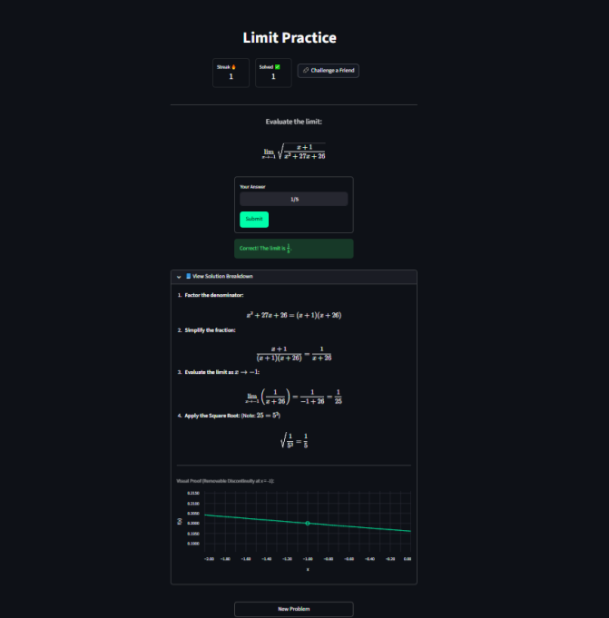

# Limit Practice Generator

A Streamlit application designed to help students practice evaluating limits involving square roots and rational expressions. Built for the CMU Technical Generalist exercise.

🔗 **[Live Demo](https://limit-practice-app.streamlit.app/)**

 

## 🎯 Project Overview
This tool generates randomized limit problems where direct substitution results in $\frac{0}{0}$. It scaffolds the learning process by:
1.  **Visualizing the Limit:** Using interactive charts to show the function approaching the limit despite the "hole" (removable discontinuity) at $x=-1$.
2.  **Scaffolded Hints:** Providing incremental clues (Strategy -> Algebra) rather than revealing the answer immediately.
3.  **Robust Feedback:** Using symbolic math checking to accept various valid input formats (fractions, decimals, unsimplified expressions).

## 🛠️ Technical Highlights
* **Symbolic Math (SymPy):** Used to parse user input flexibly (e.g., accepting `1/3`, `0.3333`, or `sqrt(1)/3`) rather than relying on brittle string matching.
* **Performance Caching:** Implementation of `@st.cache_data` for plot generation to optimize rendering performance.
* **State Management:** Custom session state logic to handle streaks, retries, and edge cases (e.g., preventing score manipulation by switching answers after failure).
* **URL State:** "Challenge a Friend" feature that encodes problem parameters into the URL, allowing specific problems to be shared.

## 🧮 The Math Logic
The generator ensures integer solutions for the limit:
$$\lim_{x\to -1} \sqrt{\frac{x+1}{x^2 + cx + b}} = \frac{1}{a}$$

To guarantee the limit exists and equals $1/a$, the backend generates a random integer $a$ and derives coefficients:
* $c = a^2 + 2$
* $b = c - 1$

This ensures the denominator factors into $(x+1)(x + a^2)$, allowing the $(x+1)$ terms to cancel.

## ⚙️ Setup & Installation

1.  **Clone the repository:**
    ```bash
    git clone [https://github.com/ddhendershott/limit-practice-app.git](https://github.com/ddhendershott/limit-practice-app.git)
    cd limit-practice-app
    ```

2.  **Install dependencies:**
    ```bash
    pip install -r requirements.txt
    ```

3.  **Run the application:**
    ```bash
    streamlit run app.py
    ```

## 📦 Requirements
* streamlit
* pandas
* numpy
* altair
* sympy